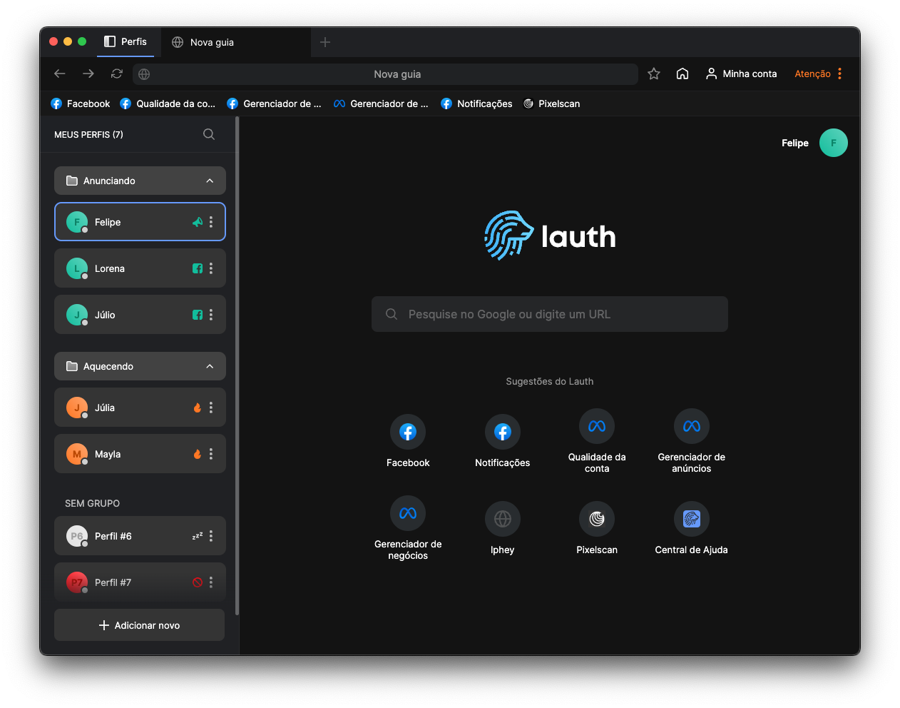

# Lauth - Navegador perfeito para gerenciar sua contingência

  

# Descrição
Simplifique a forma de trabalhar com múltiplas contas em único navegador perfeito para gerenciar anúncios e contingência com segurança e fingerprint únicos.

# Para que serve?
Lauth é perfeito para pessoas que sofrem com bloqueios em contas de anúncio, e precisa trabalhar sua contingência para manter seu trabalho sempre ativo. É um navegador multi-login onde você pode gerenciar perfis diferentes com fingerprint únicos. Mantendo sua conta segura e livre de rastreios indesejados.

# Baixe agora

# Windows
https://www.lauth.com.br/download/windows

# Mac
https://www.lauth.com.br/download/mac

# Para mais informações, acesse o site:
https://www.lauth.com.br/
